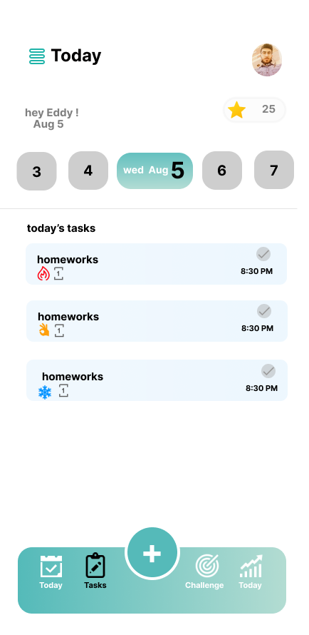
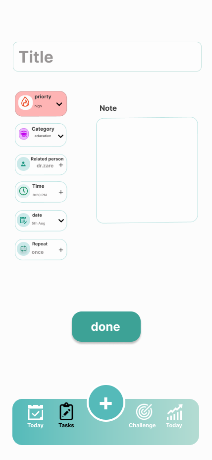
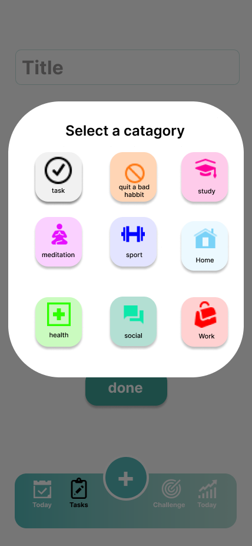

# AllTask

# Brilliant Project Management Tool

manage your projects like pros

---

 

<!--  -->

--- 
## What is allTask?
### alltask is a self management  application witch helps you to manage your personal task and also meetings. 
---

## Supported Platform 

---
## TechStack

---
## how to contribute on?
### you can contribute by pull Request to repository
### you can also open issue to request feature witch we can add to project

---

## project feature wishlist 
- Desktop Support
- WebApplication Support
- User-Group communication